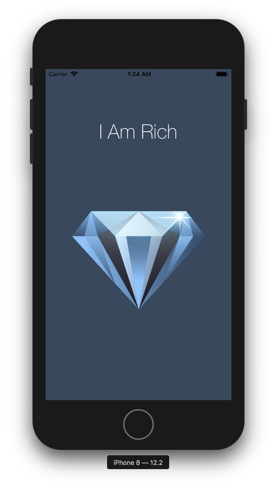

# An iPhone App Named: *I Am Rich*
This is *first practise project* for iOS app development course.

__What I have learned here:__
1. Using XCode,
2. Basic concepts on iPhone display resolutions and aspect ratio,
3. Swift 4.2 and 5,
4. Using Label and ImageView,
5. Debugging errors,
6. All about sizes of app logo and images.

___
__Screenshot:__

